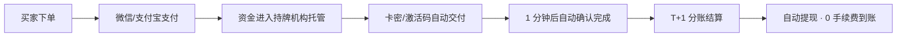

<h1 align="center">小豆开放平台 · Xiaodou Open Platform</h1>

<p align="center">
  <b>面向 OPC 的虚拟商品交易与结算基础设施</b><br/>
  卡密 · 激活码 · 虚拟物品一站式售卖 ｜ 微信 / 支付宝收款 ｜ T+1 自动到账 ｜ 自动提现 0 手续费 ｜ H5收款 ｜ 远程收款通道 ｜ api接入收款
</p>

<p align="center">
  
  
  
  
</p>

---

## 为什么是小豆开放平台？

独立开发者和超级个体（OPC, One-Person Company）做产品，最消耗精力从来不是写代码，而是：

- 收款 —— 接微信、支付宝要营业执照、要签约、ICP许可证、要对账；
- 结算 —— 钱进了渠道账户，提现还要再走一道流程；
- 售后 —— 买卖双方没有中立平台，纠纷只能各说各话；
- 风控 —— 个人收款码容易被风控，本平台不需要提供个人支付宝微信，只需要提供银行卡号，直接到账银行卡，无惧风控。

小豆开放平台把这三件事做成基础设施：**你只管卖，收款、分账、结算、提现、卖家友好平台。**

## ✨ 核心能力

### 🎫 虚拟商品交易
- 支持 **卡密、激活码、兑换码、会员、点数** 等各类虚拟物品上架
- 买家支付成功即自动交付，**交付后 1 分钟自动确认完成**，无需手动点「发货/收货」
- 交付后 48 小时售后期，到期自动关闭，风险敞口可预期
- 单笔商品单价上限 ¥20,000，小额高频、中额低频都能承载

### 💳 聚合收款
- **微信支付、支付宝** 双通道
- **信用卡、储蓄卡**银联全支持
- 买家手机直接拉起微信/支付宝付款，或者PC端H5收银台直接付款，转化路径最短

### 💰 结算与提现
- **T+1 自动结算到账**，无需人工对账申请
- **自动提现，提现 0 手续费**
- 交易资金由持牌支付机构托管，订单确认后分账结算，买卖双方资金安全有底

### 👤 低门槛进件
- **个人卖家** 与 **企业商户** 均可进件（仅身份证和收款银行卡号即可成为卖家）
- 线上提交资料，审核通过即可上架经营（资料合格1分钟通过）

### 🛡️ 售后与信用
- 「买卖家协商 → 平台仲裁」两级售后通道，纠纷有出口
- 卖家信用体系：经营记录可累积、可查询，好卖家有复利

## 💸 费率一览

| 项目 | 口径 |
| --- | --- |
| 平台服务费（小额商品，单价 ≤ ¥1,000） | **2%** |
| 提现手续费 | **0** |
| 结算周期 | T+1 自动到账 |
| 平台搭建费 | **0** |
| 保证金 | **0** |

> 例子：卖出一份 ¥50 的激活码，服务费 ¥1，**到手 ¥49，T+1 自动结算，提现一分不扣。**

> 注意：**中途有任何收费的都是骗子**

>高单价商品：单价高于¥1000商品服务费统一5% 

## 🔁 交易与资金流



## 🚀 卖家快速开始

0. **注册**：下载app 注册立即送12个月 VIP，关注博主抖音私信博主，立即再送12个月SVIP
1. **进件**：提交个人或企业资料，完成实名认证（注意 SVIP才能进件成为卖家）
2. **上架**：录入商品信息与卡密库存，设置单价（可以在 app 直接录入，也可以网页版录入商品）
3. **售卖**：分享商品链接/H5页面，买家手机app拉起微信支付宝即付或PC端扫码即付
4. **到账**：交付自动确认，T+1 自动结算，随时自动提现

## 🔌 小豆开放 API（规划中）

开放平台是下一步的重头戏：把上述能力以 **OpenAPI + H5 组件** 的形式完全开放，让你在自己的产品、网站、机器人里直接接入小豆的交易与结算能力。

**能力规划：**

| 模块 | 说明 |
| --- | --- |
| 商品管理 API | 上架 / 改价 / 库存（卡密池）管理 |
| 订单 API | 下单、查单、主动交付 |
| Webhook 通知 | 支付成功、交付完成、结算到账实时回调 |
| H5 收银台组件 | 一行代码嵌入你自己的页面 |
| 对账文件 | 每日流水与结算明细下载 |

**接入预览**（最终形态以正式文档为准）：

```bash
curl -X POST https://open-api.example/v1/orders \
  -H "Authorization: Bearer <ACCESS_TOKEN>" \
  -d '{
    "goods_id": "gd_123456",
    "out_trade_no": "my-order-0001",
    "channel": "wechat_pay",
    "notify_url": "https://your-app.example/webhook/xiaodou"
  }'
```

## 🗺️ Roadmap

- [x] 卡密 / 激活码 / 虚拟物品交易主链
- [x] 微信支付、支付宝聚合收款
- [x] T+1 自动结算与自动提现（0 手续费）
- [x] 个人 / 企业进件
- [x] 协商 + 仲裁两级售后与卖家信用体系
- [ ] 小豆开放平台 OpenAPI
- [ ] H5 API 自助接入
- [ ] 开发者控制台与沙箱环境

## 🛡️ 安全与合规

- 交易资金由持牌支付机构托管与分账，平台不经手资金池
- 全链路实名，个人 / 企业进件均需完成身份认证
- 风控与仲裁体系保障买卖双方，违规经营将被处置

## 📮 联系我们

- 商务合作与进件咨询：`luu888@foxmail.com`
- 问题反馈：博主抖音群内提交、技术指导、问题反馈
- APP下载地址：https://www.xiaodouap.cn
- 卖家经营入口：小豆集市 App 或 网址：https://pay.xiaodouap.cn/app/login
- 关注博主抖音进群送一年 SVIP，个人商家进件秒过！SVIP 赠送截止 2026/12/31


